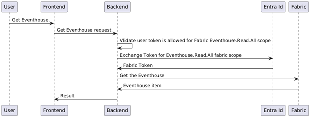
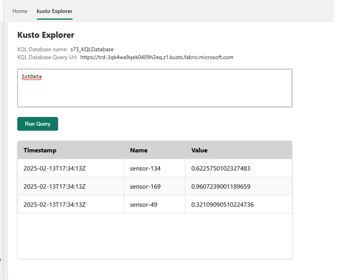

# Real Time Intelligence in Custom Workload
In this guide, you will see examples and best practices for using key scenarios of Real-Time Intelligence (RTI) products in a custom workload environment.

Custom workload, also known as the [Microsoft Fabric Workload Development Kit](https://learn.microsoft.com/en-us/fabric/workload-development-kit/development-kit-overview) allows you, as a 3rd party provider,  to create your own workload in Microsoft Fabric and publish it for any Microsoft Fabric user.
In this document, you will find examples of working with some RTI items such as:
- Eventhouse
- KQL database
- Eventstream
- Data Activator
- RTI Dashboards
- KQL Querysets

As a custom workload developer, you can integrate with any RTI item and use it as part of your experience. It can be either explicitly or “under the hood” as part of your implementation. 

Below we will examine some of the most common integrations and help provide a starting point to allow you to build more complex integrations. 

* Working with Fabric API
* Query and Control Commands for KQL Databases
* Ingesting Data to KQL Database
* Push data to Eventstream, process it and forward to a target. (Coming Soon)
* Take actions on data conditions using Data Activator. (Coming Soon)
* Embed an RTI Dashboard (Coming Soon)  
  
We are building examples for some of those scenarios, and will be sharing those in the public Samples of workloads such as [Microsoft-Fabric-workload-development-sample](https://github.com/microsoft/Microsoft-Fabric-workload-development-sample), or the [RTI Workload Sample](https://github.com/microsoft/Microsoft-Fabric-RTI-Workload-Development-Sample).

## Creating your Custom item

> [!IMPORTANT]  
> This section summarizes my experience of working with the custom workload environment. For a more detailed description please refer to [Microsoft Fabric Workload Development Kit documentation](https://learn.microsoft.com/en-us/fabric/workload-development-kit/development-kit-overview).

As a workload developer you can create either a frontend only experience, or add an additional backend experience to it.

In addition, you can create your own item with full [CRUD](https://learn.microsoft.com/en-us/fabric/workload-development-kit/extensibility-front-end#crud-operations)  experience (Create, Read, Update, Delete),  and let Fabric users create and interact with it, like with any other Microsoft item available in Fabric. This will add your item to the workspace view. 
In brief:
-	Your frontend workload extension will call the Fabric SDK to create an item
-	Fabric SDK will forward the request to your backend extension.
-	Your backend extension will receive the create request and will need to handle it, here, you will need to process and store the metadata for item as well as triggering any additional calls related your item, for example create an Eventhouse item and “bond” it to your item.

For more detailed explanation, please refer to the development kit documentation [Frontend](https://learn.microsoft.com/en-us/fabric/workload-development-kit/extensibility-front-end) guide, [Backend](https://learn.microsoft.com/en-us/fabric/workload-development-kit/extensibility-back-end) guide. 
 
### Working with Fabric Public API – CRUD for RTI items
In some scenarios, you might want to have CRUD interaction with any Fabric item in the workspace, for example [Create a KQL database](https://learn.microsoft.com/en-us/rest/api/fabric/kqldatabase/items/create-kql-database?tabs=HTTP), [Get an Eventhouse](https://learn.microsoft.com/en-us/rest/api/fabric/eventhouse/items/get-eventhouse?tabs=HTTP), [List all KQL database](https://learn.microsoft.com/en-us/rest/api/fabric/kqldatabase/items/list-kql-databases?tabs=HTTP) in a Workspace, or simply call any other public API. 



## Working Fabric Eventhouse/KQL Database APIs
### Example: Getting an Eventhouse Item
In the RTI Sample App you have the ability to browse and select an Eventhouse that is in the customer’s environment.

This allows you to get important metadata on the Eventhouse such as the query Uri, databases, etc. 

Here is a sample code for the backend controller handling the request (based on the sample workload project).

```
[HttpGet("eventhouse/{workspaceId}/{eventhouseId}")]
public async Task<IActionResult> GetEventhouse(Guid workspaceId, Guid eventhouseId)
{
    try
    {
        _logger.LogInformation("GetEventhouse: get eventhouse '{0}' in workspace '{1}'",
            eventhouseId, workspaceId);
 
        var authorizationContext = await _authenticationService
        AuthenticateDataPlaneCall(
             _httpContextAccessor.HttpContext,
             allowedScopes: new string[] { WorkloadScopes.EventhouseReadAll });
         var token = await _authenticationService.GetAccessTokenOnBehalfOf(authorizationContext, EventhouseFabricScopes);
  
         var url = $"{EnvironmentConstants.FabricApiBaseUrl}/v1/workspaces/{workspaceId}/eventhouses/{eventhouseId}";
  
         var response = await _httpClientService.GetAsync(url, token);
         var eventhouse = await response.Content.ReadAsAsync<EventhouseItem>();
         return Ok(eventhouse);
    }
    catch (AuthenticationException ex)
    {
        _logger.LogError($"GetEventhouse: Failed authenticate Eventhouse {eventhouseId} " +
                         $"in workspace: {workspaceId}. Error: {ex.Message}");
        return Unauthorized();
    }
    catch (Exception ex)
    {
        _logger.LogError($"GetEventhouse: Failed to retrieve Eventhouse {eventhouseId}" +
                         $" in workspace: {workspaceId}. Error: {ex.Message}");
        return BadRequest();
    }
}
```  

1.	The incoming request is a GET request containing the Workspace id and the item id of the Eventhouse
2.	Authenticate the request and make sure it is permitted for Eventhouse.Read.All scope
3.	Exchange the original Token for a [Fabric Eventhouse scope](https://analysis.windows.net/powerbi/api/)
4.	Call the [Fabric client API](https://learn.microsoft.com/en-us/rest/api/fabric/eventhouse/items/get-eventhouse?tabs=HTTP) to retrieve the Eventhouse item
5.	 Parse the Fabric client response and return it.


As an alternative to calling Fabric API using a rest client, you can use the [Fabric client SDK](https://www.nuget.org/packages/Microsoft.Fabric.Api/) and call Get Eventhouse using it.  

```
 using System;
 using System.Threading.Tasks;
 using Microsoft.Fabric.Api;
 using Microsoft.Fabric.Api.Eventhouse.Models;
  
 public class FabricApiClient : IFabricApiClient
 {
     private Uri _fabricBaseUri = new("https://api.fabric.microsoft.com");
 
    public async Task<Eventhouse> GetEventhouse(Guid workspaceId, Guid eventhouseId, string token)
    {
        var fabricClient = new FabricClient(token, _fabricBaseUri);
 
        return await fabricClient.Eventhouse.Items.GetEventhouseAsync(workspaceId, eventhouseId);
    }

}
```  

### Example: Create a KQL database
Another common crud operation is to create an item in the customer’s tenant. In the RTI Sample app as part of the workflow of creating an item we create a KQL Database.
As seen in the example above, we can use a similar flow and create a new KQL database in Workspace.

```
 [HttpPost("workspaces/{workspaceId}/eventhouses/{eventhouseId}/kqlDatabases")]
 public async Task<IActionResult> CreateKqlDatabase(Guid workspaceId, Guid eventhouseId)
 {
     try
     {
         _logger.LogInformation("CreateKqlDatabase: creating a KQL database in eventhouse '{0}' in workspace '{1}'",
             eventhouseId, workspaceId);
  
         var authorizationContext = await _authenticationService.AuthenticateDataPlaneCall(
            _httpContextAccessor.HttpContext, allowedScopes: new string[] { WorkloadScopes.KQLDatabaseReadWriteAll });
        var token = await _authenticationService.GetAccessTokenOnBehalfOf(authorizationContext, KqlDatabaseFabricScopes);
 
        var fabricClient = new FabricClient(token, new("https://api.fabric.microsoft.com"));
 
        var databaseDisplayName = "Kql_" + Guid.NewGuid();
        var createKqlDatabaseRequest = new CreateKQLDatabaseRequest(databaseDisplayName)
        {
            CreationPayload = new ReadWriteDatabaseCreationPayload(eventhouseId)
        };
 
        var database = await fabricClient.KQLDatabase.Items.CreateKQLDatabaseAsync(workspaceId, createKqlDatabaseRequest);
        
        return Ok(database);
    }
    catch (Exception ex)
    {
        _logger.LogError($"CreateKqlDatabase: Failed to create KQL database for Eventhouse {eventhouseId}" +
                         $" in workspace: {workspaceId}. Error: {ex.Message}");
        return BadRequest();
    }
}
```  
1.	The incoming request is a POST request containing the Workspace id and the item id of the Eventhouse, note the controller doesn’t parse a body for this request, if needed it can be added and provide additional parameters for the request.
2.	Authenticate the request and make sure it is permitted for KQLDatabase.ReadWrite.All scope
3.	Exchange the original Token for a Fabric KQL database scope https://analysis.windows.net/powerbi/api/KQLDatabase.ReadWrite.All
4.	Call the Fabric API to [create a KQL database item](https://learn.microsoft.com/en-us/rest/api/fabric/kqldatabase/items/create-kql-database?tabs=HTTP4), note that the Eventhouse Id is part of the request
5.	 Parse the Fabric client response and return it.

### Example: KQL queries and management commands:
One of the key scenarios of KQL database and Evenhouse items is executing KQL queries and management commands.  For instance, I might need to configure tables, schema, update policy, retention settings, etc.. for the data that will be stored in the KQL Database. I can do all of this via management commands. 

On the other hand, once data is stored in the KQL Database I may need to query the data and present it to the client for analytics. This will be done via KQL Queries.

To query we will be using the [Kusto Rest API](https://learn.microsoft.com/en-us/kusto/api/rest/?view=microsoft-fabric) either in its pure rest form, or via one of the SDKs supported for various language, such as [.NET SDK](https://learn.microsoft.com/en-us/kusto/api/netfx/about-the-sdk?view=microsoft-fabric) or [Node SDK](https://learn.microsoft.com/en-us/kusto/api/node/kusto-node-client-library?view=microsoft-fabric).


#### Required Delegate permissions
To use the Kusto REST API, we need a token that is valid for Kusto scope. This means the backend must exchange the user’s Fabric token for a Kusto token. For this to work:
1.	Consent to Impersonation: The consumer must agree to Kusto user impersonation.
2.	Workload application permission: In the Azure portal, when [setting up authentication](https://learn.microsoft.com/en-us/fabric/workload-development-kit/authentication-tutorial) for the workload application, add the ‘user_impersonation’ delegated permission for ‘Azure Data Explorer’.

#### Authorized principal 
In addition to being able to exchange a token with the Kusto audience, the original caller must have the appropriate permissions on the database to execute the desired query or management operation. For more details, please refer to Security roles overview.

In the context of Fabric, there are several levels of permission:
- Security Role on Cluster/Database/Table: The user is listed as a principal (or a member of a security group) with an appropriate security role on the cluster, database, or table.
- Fabric Workspace Permissions: The user has permission on the Fabric Workspace that contains the Eventhouse or KQL database item.
- If a user has Viewer access on the workspace, he will also have a reader permission on the Eventhouse\KQL database.
- If a user has Admin access on the workspace, he will also have an Admin permission on the Eventhouse\KQL database.

### KQL query 
In this scenario, we’ll demonstrate how the workload backend queries the database and returns the result to the user.

1.	The user will interact with the Frontend page to trigger the flow.
2.	Frontend extension will call the workload backend with the query request.  
3.	Backend will validate the Fabric token and the query request.
4.	Backend will exchange the user Fabric token to a Kusto audience token, specifically for the query Uri of the Eventhouse\KQL database.
5.	Backend will trigger a KQL query request on the Eventhouse (via Kusto rest API on the query Uri) 
6.	Eventhouse will execute the query request and will return the dataset result
7.	Backend will format the result and return it to the frontend.
8.	Frontend will visualize the result. 

#### Code example
In the RTI Sample app you can execute queries and see the results inside the KQL Database that you provisioned when creating the app.



In the following code example, we will demonstrate how this is accomplished using the backend controller for querying a KQL Database. 

This is the class representing the request body
```
public class QueryKqlDatabaseRequest
{
    public string QueryServiceUri { set; get; }
 
    public string DatabaseId { set; get; }
 
    public string Query { set; get; }
}
```  

An example of a request
```
{
    "QueryServiceUri": "https://trd-56z2kxu7mxbddgjqk4.z1.kusto.fabric.microsoft.com",
    "DatabaseId": "35b3eb82-f902-4549-aad8-00f2c7a195be",
    "Query": "MyTable| take 10"
}
```
```

[HttpPost("KqlDatabases/query")]
public async Task<IActionResult> QueryKqlDatabase([FromBody] QueryKqlDatabaseRequest request)
 {
     try
     {
         var authorizationContext = await _authenticationService.AuthenticateDataPlaneCall(
             _httpContextAccessor.HttpContext, allowedScopes: new string[] { WorkloadScopes.KQLDatabaseReadAll });
         var scopes = new[] { $"{request.QueryServiceUri}/.default" };
         var token = await _authenticationService.GetAccessTokenOnBehalfOf(authorizationContext, scopes);
 
        var clientRequestProperties = GenerateClientRequestProperties(token);
        var dataReader = await _kustoClientService.ExecuteQueryAsync(
            request.QueryServiceUri, request.DatabaseId, request.Query, clientRequestProperties, default);
 
        var dataTable = new DataTable();
        dataTable.Load(dataReader);
 
        var serializedDataTable = JsonConvert.SerializeObject(dataTable);
        var jsonTable = JArray.Parse(serializedDataTable);
 
        return Ok(jsonTable);
 
        // An alternative method will be to return the result as a stream, it will be more      efficient in terms of performance,
        // but will require additional processing on the client side. 
        //var stream = KustoJsonDataStream.GetReaderDataAsStream(dataReader);
 
        //return Ok(stream);
    }
    catch (Exception ex)
    {
        _logger.LogError($"QueryKqlDatabase: Query execution failed for cluster {request.QueryServiceUri}" +
                         $" Error: {ex.Message}");
        return Problem();
    }
}
```  
1.	The backend controller implements a Query endpoint as a POST request.
2.	Validate the user token is allowed for scope KQLDatabase.ReadWrite.All
3.	Exchange the token for the Eventhouse\database query Uri scope.
The query URI can be obtained by send a GET request for a [KQL database](https://learn.microsoft.com/en-us/rest/api/fabric/kqldatabase/items/get-kql-database?tabs=HTTP#kqldatabaseproperties) or an [Eventhouse](https://learn.microsoft.com/en-us/rest/api/fabric/kqldatabase/items/get-kql-database?tabs=HTTP#kqldatabaseproperties).
4.	Next we create a [ClientRequestProperties](https://learn.microsoft.com/en-us/kusto/api/netfx/client-request-properties?view=microsoft-fabric) this is object is going to be one of the parameters for the query request sent to the Kusto service query endpoint. It allows various configuration for the KQL query, as well as the auth token.  
5.	Send the query request via KustoClientService
6.	Once the query request is completed, the controller end point will serialize and return it. 
> [!NOTE]  
> There are many ways and formats to return results, each with its own pros and cons.
```
 private ClientRequestProperties GenerateClientRequestProperties(string token)
 {
     var properties = new ClientRequestProperties
     {
         ClientRequestId = GetRequestIdHeader() ?? Guid.NewGuid().ToString(),
         AuthorizationScheme = "Bearer",
         SecurityToken = token
     };
 
    properties.SetOption(ClientRequestProperties.OptionServerTimeout, TimeSpan.FromSeconds(30));
    return properties;
}
```  
```
 using System.Data;
 using System.Threading;
 using System.Threading.Tasks;
 using Kusto.Data.Common;
  
 public class KustoClientService : IKustoClientService
 {
     private readonly IKustoStatelessClient _kustoStatelessClient;
  
    public KustoClientService(IKustoStatelessClient kustoStatelessClient)
    {
        _kustoStatelessClient = kustoStatelessClient;
    }
 
    public async Task<IDataReader> ExecuteQueryAsync(
        string queryUrl,
        string databaseName,
        string query,
        ClientRequestProperties clientRequestProperties = null,
        CancellationToken cancellationToken = default)
    {
        return await _kustoStatelessClient.ExecuteQueryAsync(queryUrl, databaseName, query,
            clientRequestProperties, cancellationToken).ConfigureAwait(false);
    }
 
    public async Task<IDataReader> ExecuteControlCommandAsync(
        string queryUrl,
        string databaseName,
        string command,
        ClientRequestProperties clientRequestProperties = null,
        CancellationToken cancellationToken = default)
    {
        return await _kustoStatelessClient.ExecuteControlCommandAsync(queryUrl, databaseName, command,
            clientRequestProperties, cancellationToken).ConfigureAwait(false);
    }
}
```  
Good to know

1.	If token exchange fails due to "AADSTS65001: The user or administrator has not consented to use the application with ID xxxxx", make sure the user consented to the required scope of 'Azure data explorer'
2.	The above query diagram represents a flow for a query that can run in under 30 seconds time limit. While Kusto can support long (time) queries execution, in this scenario an additional layer of LRO (long running operations) is required to support it.

### Example: Create a table in KQL database
Similarly to executing a query, you can execute a KQL management command. We will demonstrate such a request where the management command is [create a table](https://learn.microsoft.com/en-us/kusto/management/create-table-command?view=microsoft-fabric5).

This is the class representing the request body sent to the backend controller
```
public class KqlDatabaseManagementRequest
{
    public string QueryServiceUri { set; get; }
 
    public string DatabaseId { set; get; }
 
    public string Command { set; get; }
}
```
And here is an example of a request to create a table
```
{
    "QueryServiceUri": "https://trd-56z2kxu7mxbddgjqk4.z1.kusto.fabric.microsoft.com",
    "DatabaseId": "35b3eb82-f902-4549-aad8-00f2c7a195be",
    "Command": ".create table MyLogs ( Level:string, Timestamp:datetime, UserId:string )"
}
```
The conntroller handling the request is very similar to the query flow we showed above.
```
 [HttpPost("KqlDatabases/mgmt")]
 public async Task<IActionResult> ExecuteManagementCommandKqlDatabase([FromBody] KqlDatabaseManagementRequest request)
 {
     try
     {
         var authorizationContext = await _authenticationService.AuthenticateDataPlaneCall(
             _httpContextAccessor.HttpContext, allowedScopes: new string[] { WorkloadScopes.KQLDatabaseReadWriteAll });
         var scopes = new[] { $"{request.QueryServiceUri}/.default" };
         var token = await _authenticationService.GetAccessTokenOnBehalfOf(authorizationContext, scopes);
 
        var clientRequestProperties = GenerateClientRequestProperties(token);
        var dataReader = await _kustoClientService.ExecuteControlCommandAsync(
            request.QueryServiceUri, request.DatabaseId, request.Command, clientRequestProperties, default);
 
        var dataTable = new DataTable();
        dataTable.Load(dataReader);
 
        var serializedDataTable = JsonConvert.SerializeObject(dataTable);
        var jsonTable = JArray.Parse(serializedDataTable);
 
        return Ok(jsonTable);
 
        // An alternative method will be to return the result as a stream, it will be more efficient in terms of performance,
        // but will require additional processing on the client side. 
        //var stream = KustoJsonDataStream.GetReaderDataAsStream(dataReader);
 
        //return Ok(stream);
    }
    catch (Exception ex)
    {
        _logger.LogError($"ExecuteManagementCommandKqlDatabase: management command execution " +
                         $"failed for cluster {request.QueryServiceUri} Error: {ex.Message}");
        return Problem();
    }
}
``` 
1.	The backend controller implements a POST request endpoint handling management KQL command execution on KQL databases.
2.	Validate the user token is allowed for scope KQLDatabase.ReadWrite.All
3.	Exchange the token for the Eventhouse\database query Uri scope. 
The query URI can be obtained by send a GET request for a [KQL database](https://learn.microsoft.com/en-us/rest/api/fabric/kqldatabase/items/get-kql-database?tabs=HTTP#kqldatabaseproperties) or an [Eventhouse](https://learn.microsoft.com/en-us/rest/api/fabric/kqldatabase/items/get-kql-database?tabs=HTTP#kqldatabaseproperties).
4.	Next we create a [ClientRequestProperties](https://learn.microsoft.com/en-us/kusto/api/netfx/client-request-properties?view=microsoft-fabric) this is object is going to be one of the parameters for the management request sent to the Kusto service query endpoint. It allows various configuration for the KQL query, as well as the auth token.  
5.	Send the management command request via KustoClientService
6.	Once the management request is completed, the controller will serialize and return it. 
Note that there are many ways and formats to return results, each with its own pros and cons.

Difference Between KQL Query & management commands
1.	Syntax wise, all management commands starts with a ‘.’ 
For example – 
“.show tables”  
“.create table MyLogs ( Level:string, Timestamp:datetime)”
2.	 [Kusto client REST API](https://learn.microsoft.com/en-us/kusto/api/rest/?view=microsoft-fabric) - /query for query and /mgmt for executing management command.
3.	Permissions, each operations requires a different role, Query usually requires a reader permission, while management operation will require reader for “.show” operation and higher for “.create …” “.alter … “ operations.

### Example: Ingesting data to a KQL database
In this section we will cover some methods of ingesting data to a KQL database and make it available for queries.

Kusto offers many ways for ingesting data to a database, some directly to Kusto, and others via external resources\connectors.

For Kusto only, we have the following ways:
* [Kusto streaming ingestion](https://learn.microsoft.com/en-us/kusto/api/rest/streaming-ingest?view=microsoft-fabric)
* [Kusto queued ingestion](https://learn.microsoft.com/en-us/kusto/api/get-started/app-queued-ingestion?view=azure-data-explorer&tabs=app%2Ccsharp)
* [Kusto inline ingestion](https://learn.microsoft.com/en-us/kusto/management/data-ingestion/ingest-inline?view=microsoft-fabric) – POC only, not for production purposes  

#### Required Delegate Permissions
Since we will be using the Kusto API Rest API, we need a token that is valid for Kusto scope, and that the caller has appropriate permissions for the request.

Please refer to “Executing queries on a KQL database” in this doc, for a detailed description of the delegate permission and Authorized principal.

#### Kusto Queued ingestion
This method is optimized for high ingestion throughput. Data is batched based on ingestion properties, with small batches then merged and optimized for fast query results. 

This method uses retry mechanisms to mitigate transient failures and follows the 'at least once' messaging semantics to ensure no messages are lost in the process.

By default, the maximum queued values are 5 minutes, 1000 items, or a total size of 1 GB. The data size limit for a queued ingestion command is 6 GB.

The data that is going to be ingested can be provided via:
-	A link to a file in a local directory.
-	A link to an external file, for example an Azure blob with public access or a SAS token.
-	A simple string with the content.

We are going to summarize the prerequisites set up and show some code snippets for the backend controller implementation. For more information

I highly recommend checking the following links as they contain detailed examples and information:
-	[Create an app to get data using queued ingestion](https://learn.microsoft.com/en-us/kusto/api/get-started/app-queued-ingestion?view=azure-data-explorer&tabs=app%2Ccsharp)
-	[Supported formats](https://learn.microsoft.com/en-us/azure/data-explorer/ingestion-supported-formats)
-	[Data ingestion properties](https://learn.microsoft.com/en-us/kusto/ingestion-properties?view=azure-data-explorer&preserve-view=true)

Prerequisites
-	[Create a table](https://learn.microsoft.com/en-us/kusto/management/create-table-command?view=microsoft-fabric) where the data will be ingested.
-	Setup the [ingestion batching policy](https://learn.microsoft.com/en-us/kusto/management/batching-policy?view=microsoft-fabric) (optional).
-	Setup [ingestion mapping](https://learn.microsoft.com/en-us/kusto/management/mappings?view=microsoft-fabric) (optional).

Here is a code sample showing the controller handling the queued ingestion request as well as the request body.

```
 [HttpPost("KqlDatabases/queuedIngest")]
 public async Task<IActionResult> QueuedIngestToKqlDatabase([FromBody] KqlDatabaseIngestRequest request)
 {
     try
     {
         var authorizationContext = await _authenticationService.AuthenticateDataPlaneCall(
             _httpContextAccessor.HttpContext, allowedScopes: new string[] { WorkloadScopes.KQLDatabaseReadWriteAll });
         var scopes = new[] { $"{request.IngestionServiceUri}/.default" };
 
        var token = await _authenticationService.GetAccessTokenOnBehalfOf(authorizationContext, scopes);
        var ingestKcsb = new KustoConnectionStringBuilder(request.IngestionServiceUri).WithAadUserTokenAuthentication(token);
 
        var ingestProps = CreateQueuedIngestionProperties(request);
 
        using (var memoryStream = new MemoryStream())
        await using (var streamWriter = new StreamWriter(memoryStream))
        using (var ingestClient = KustoIngestFactory.CreateQueuedIngestClient(ingestKcsb))
        {
            await streamWriter.WriteAsync(request.Content);
            await streamWriter.FlushAsync();
            memoryStream.Seek(0, SeekOrigin.Begin);
 
            await ingestClient.IngestFromStreamAsync(memoryStream, ingestProps);
        }
 
        return Ok();
    }
    catch (Exception ex)
    {
        _logger.LogError($"QueuedIngestToKqlDatabase: failed ingesting to {request.IngestionServiceUri} " +
                         $"Error: {ex.Message}");
        return Problem();
    }
}
```  

1.	Our controller implements an endpoint handling queued ingestion requests to a KQL database. 
2.	Validate the user token is allowed for scope KQLDatabase.ReadWrite.All
3.	Exchange the token for the Eventhouse\database ingestion Uri scope. 
The query URI can be obtained by send a GET request for a [KQL database](https://learn.microsoft.com/en-us/rest/api/fabric/kqldatabase/items/get-kql-database?tabs=HTTP#kqldatabaseproperties) or an [Eventhouse](https://learn.microsoft.com/en-us/rest/api/fabric/kqldatabase/items/get-kql-database?tabs=HTTP#kqldatabaseproperties).
4.	Create a KustoConnectionStringBuilder for the service ingesting Uri using the OBO token.
5.	Create KustoQueuedIngestionProperties object containing the in information for the ingestion.
6.	Create a stream containing the string content provided in the request.
7.	Ingest the stream. 

Note that in this example we presented ingestion of string content, alternative we could provide a link to file and ingest it, calling 
```
Task<IKustoIngestionResult> IngestFromStorageAsync(
  string uri,
  KustoIngestionProperties ingestionProperties,
  StorageSourceOptions sourceOptions = null);
```

We used the following class for the request body
```
public class KqlDatabaseIngestRequest
{
    public string IngestionServiceUri { set; get; }
    public string DatabaseName { set; get; }
    public string Table { get; set; }
    public string IngestionMappingName { get; set; }
    public string Content { set; get; }
}
```

And here is the example for the KustoQueuedIngestionProperties
```
private KustoQueuedIngestionProperties CreateQueuedIngestionProperties(KqlDatabaseIngestRequest request)
 {
     var ingestProps = new KustoQueuedIngestionProperties(request.DatabaseName, request.Table);
     ingestProps.ReportLevel = IngestionReportLevel.FailuresAndSuccesses;
     ingestProps.ReportMethod = IngestionReportMethod.Queue;
     ingestProps.IngestionMapping.IngestionMappingReference = request.IngestionMappingName;
     ingestProps.Format = DataSourceFormat.json;
  
     return ingestProps;
 }
 ```
#### Kusto Streaming ingestion
This method is optimized for low latency ingestions, when latency of less than a few seconds is required. Best to use where the stream of data into each table is relatively small (a few records per second) 

The data that is going to be ingested can be provided via:
-	A link to a file in a local directory.
-	A link to an external file, for example an Azure blob with public access or a SAS token.
-	A simple string with the content.

We are going to summarize the prerequisite setup and show some code snippets for the backend controller implementation.

For more information I highly recommend checking the following links as they contain detailed examples and information:
-	[Streaming ingestion policy](https://learn.microsoft.com/en-us/kusto/management/streaming-ingestion-policy?view=azure-data-explorer)
-	[Streaming ingestion sample](https://github.com/Azure/azure-kusto-samples-dotnet/blob/master/client/StreamingIngestionSample/Program.cs)
-	[Data ingestion properties](https://learn.microsoft.com/en-us/kusto/ingestion-properties?view=azure-data-explorer&preserve-view=true)

Prerequisites
-	[Create a table](https://learn.microsoft.com/en-us/kusto/management/create-table-command?view=microsoft-fabric) where the data will be ingested.
-	Setup the [streaming ingestion policy](https://learn.microsoft.com/en-us/kusto/management/streaming-ingestion-policy?view=azure-data-explorer).
-	Setup [ingestion mapping](https://learn.microsoft.com/en-us/kusto/management/mappings?view=microsoft-fabric) (optional).

Here is a code sample showing the controller handling the streaming ingestion request as well as the request body.

```
 [HttpPost("KqlDatabases/streamIngest")]
 public async Task<IActionResult> StreamIngestToKqlDatabase([FromBody] KqlDatabaseIngestRequest request)
 {
     try
     {
5         var authorizationContext = await _authenticationService.AuthenticateDataPlaneCall(
             _httpContextAccessor.HttpContext, allowedScopes: new string[] { WorkloadScopes.KQLDatabaseReadWriteAll });
         var scopes = new[] { $"{request.IngestionServiceUri}/.default" };
 
        var token = await _authenticationService.GetAccessTokenOnBehalfOf(authorizationContext, scopes);
        var ingestKcsb = new KustoConnectionStringBuilder(request.IngestionServiceUri).WithAadUserTokenAuthentication(token);
 
        var ingestProps = CreateKustoIngestionProperties(request);
 
        using (var memoryStream = new MemoryStream())
        await using (var streamWriter = new StreamWriter(memoryStream))
        using (var ingestClient = KustoIngestFactory.CreateStreamingIngestClient(ingestKcsb))
        {
            await streamWriter.WriteAsync(request.Content);
            await streamWriter.FlushAsync();
            memoryStream.Seek(0, SeekOrigin.Begin);
 
            await ingestClient.IngestFromStreamAsync(memoryStream, ingestProps);
        }
 
        return Ok();
    }
    catch (Exception ex)
    {
        _logger.LogError($"StreamIngestToKqlDatabase: failed ingesting to {request.IngestionServiceUri} " +
                         $"Error: {ex.Message}");
        return Problem();
    }
}
```  

1.	Our controller implements an endpoint handling streaming ingestion requests to a KQL database. 
2.	Validate the user token is allowed for scope KQLDatabase.ReadWrite.All
3.	Exchange the token for the Eventhouse\database ingestion Uri scope. 
The query URI can be obtained by send a GET request for a [KQL database](https://learn.microsoft.com/en-us/rest/api/fabric/kqldatabase/items/get-kql-database?tabs=HTTP#kqldatabaseproperties) or an [Eventhouse](https://learn.microsoft.com/en-us/rest/api/fabric/kqldatabase/items/get-kql-database?tabs=HTTP#kqldatabaseproperties).
4.	Create a KustoConnectionStringBuilder for the service ingesting Uri using the OBO token.
5.	Create KustoIngestionProperties object containing the in information for the ingestion.
6.	Create a stream containing the string content provided in the request.
7.	Ingest the stream. 

Note that in this example we presented ingestion of string content, alternative we could provide a link to file and ingest it, calling 
```
Task<IKustoIngestionResult> IngestFromStorageAsync(
  string uri,
  KustoIngestionProperties ingestionProperties,
  StorageSourceOptions sourceOptions = null);
```

We used the following class for the request body
```
public class KqlDatabaseIngestRequest
{
    public string IngestionServiceUri { set; get; }
    public string DatabaseName { set; get; }
    public string Table { get; set; }
    public string IngestionMappingName { get; set; }
    public string Content { set; get; }
}
```

And here is the example for the KustoIngestionProperties
```
private KustoIngestionProperties CreateKustoIngestionProperties(KqlDatabaseIngestRequest request)
 {
     var ingestProps = new KustoQueuedIngestionProperties(request.DatabaseName, request.Table)
     {
         IngestionMapping =
                 {
                     IngestionMappingReference = request IngestionMappingName
                },
        Format = DataSourceFormat.json
    };
  
    return ingestProps;
}
```
#### Kusto Inline Ingestion
[Kusto inline ingestion](https://learn.microsoft.com/en-us/kusto/management/data-ingestion/ingest-inline?view=microsoft-fabric) is a management command allowing data to insert into a table.

Note we are providing this example as it is good mostly for exploration and prototyping, don’t use it in production or high-volume scenarios.

In order to execute such an ingestion command we can use the controller shown above in Example: Create a table in KQL database

Our request will look like this
```
{
    "QueryServiceUri": "https://trd-56z2kxu7mxbddgjqk4.z1.kusto.fabric.microsoft.com",
    "DatabaseId": "35b3eb82-f902-4549-aad8-00f2c7a195be",
    "Command": ".ingest inline into table Purchases <| \n Shoes,1000 \n Wide Shoes,50 \n "
}
```  

For more information please refer to the [.ingest inline command](https://learn.microsoft.com/en-us/kusto/management/data-ingestion/ingest-inline?view=microsoft-fabric)
